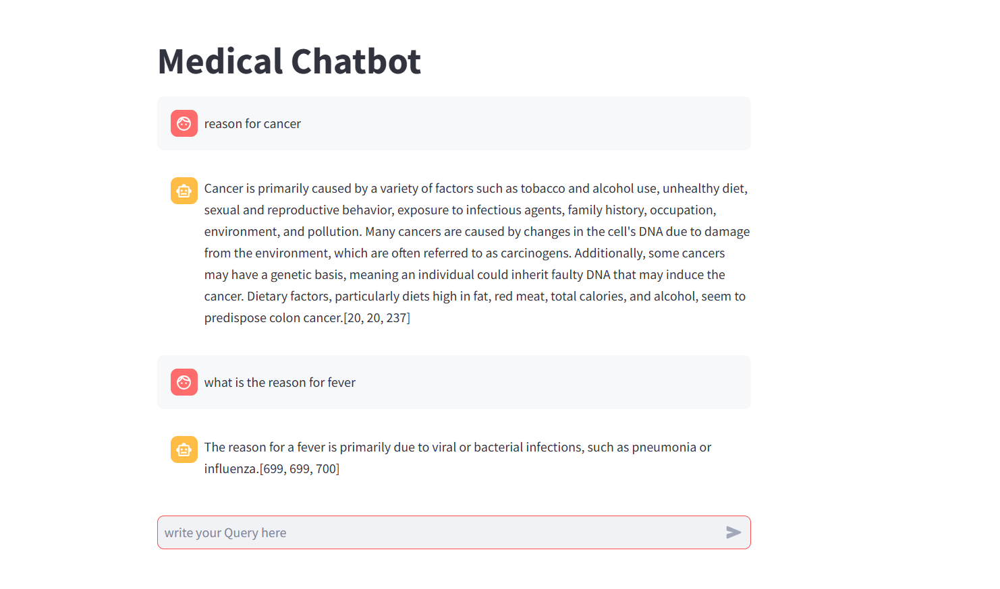

Medical Chatbot

build a smart Medical Chatbot using open-source tools. 
use HuggingFace for embeddings
FAISS CPU for vector storage
LLM -Mistral 
Streamlit for deployment 
create_memory.py
framework used - langchain

